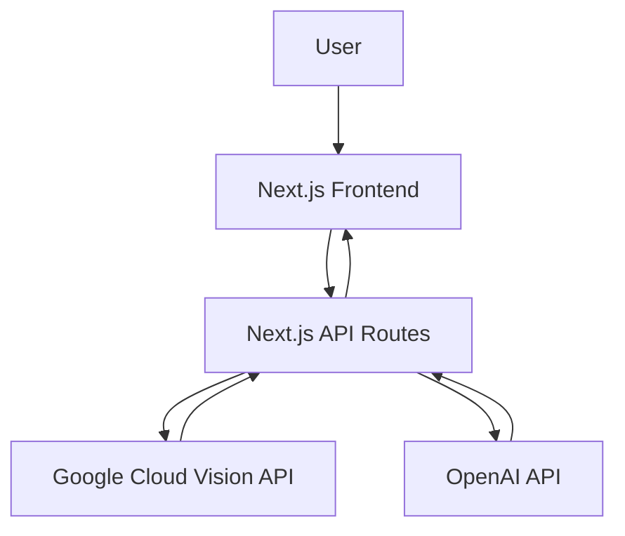
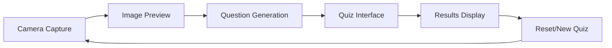
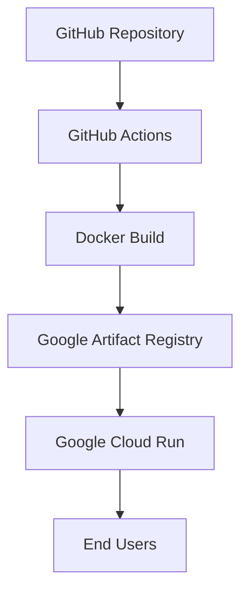

# System Patterns: Study Quiz App

## Architecture Overview
The Study Quiz App follows a client-server architecture with a Next.js frontend and serverless API routes. The application is containerized using Docker for deployment to Google Cloud Run.

## Key Components

### Frontend Components
- **CameraComponent**: Handles image capture from device camera
- **QuestionGenerator**: Manages the process of sending images to the API and receiving generated questions
- **QuizComponent**: Presents questions and captures user answers
- **ResultsComponent**: Displays quiz results and provides feedback

### Backend Services
- **API Routes**: Next.js API routes that handle requests from the frontend
- **Cloud Vision Integration**: Service for extracting text from images
- **OpenAI Integration**: Service for generating quiz questions based on extracted text

## Design Patterns

### State Management
- React's useState hook for local component state
- Props for passing data between parent and child components
- No global state management as the application flow is linear

### Component Lifecycle

### API Communication
- RESTful API endpoints for communication between frontend and backend
- JSON for data exchange
- Async/await pattern for handling asynchronous operations

## Deployment Architecture

## Error Handling
- Try/catch blocks for API calls
- User-friendly error messages
- Fallback UI states for loading and error conditions
